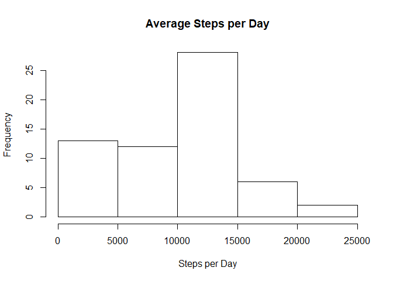
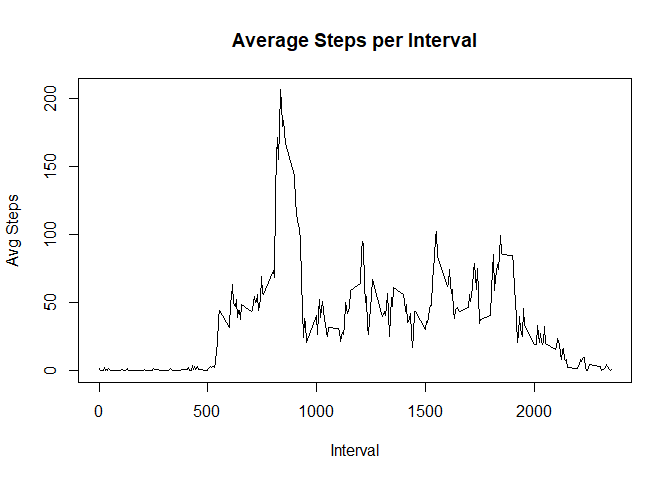
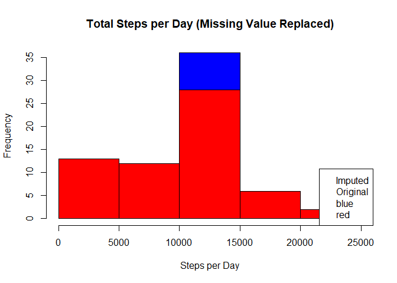
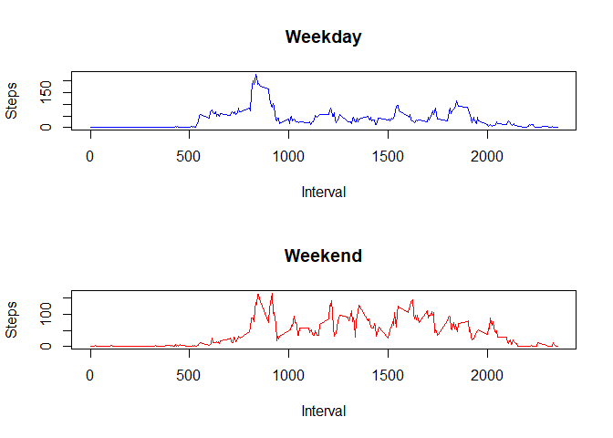

## Loading and preprocessing the data
1. Unzip data file.

```r
unzip("activity.zip")
```

2. Read .csv file.

```r
activity <- read.csv("activity.csv", sep = ",", header = TRUE)
```

3. Check data summary statistics.

```r
summary(activity)
str(activity)
```

## What is mean total number of steps taken per day?
1. Calculate Steps per Day. Remove NA values before calculation.


```r
library("dplyr")
```

```
## Warning: package 'dplyr' was built under R version 3.5.3
```

```
## 
## Attaching package: 'dplyr'
```

```
## The following objects are masked from 'package:stats':
## 
##     filter, lag
```

```
## The following objects are masked from 'package:base':
## 
##     intersect, setdiff, setequal, union
```

```r
tbl_df(activity)
```


```r
stepperday <- activity %>% group_by(date) %>% summarise(totalstep = sum(steps, na.rm = TRUE))
```

2. Make a histogram of the total number of steps taken each day

```r
hist(stepperday$totalstep, xlab = "Steps per Day", main = "Average Steps per Day")
```

<!-- -->

3. Calculate and report the mean and median total number of steps taken per day

```r
stepmean <- mean(stepperday$totalstep, na.rm = TRUE)
stepmedian <- median(stepperday$totalstep, na.rm = TRUE)
stepmean
```

```
## [1] 9354.23
```

```r
stepmedian
```

```
## [1] 10395
```
Mean total number of steps taken per day is 9354.23.
Median total number of steps taken per day is 10395.


## What is the average daily activity pattern?
1. Make a time series plot (i.e. type = "l") of the 5-minute interval (x-axis) and the average number of steps taken, averaged across all days (y-axis)

```r
stepperinter <- activity %>% group_by(interval) %>% summarise(stepperinterval=(mean(steps, na.rm = TRUE)))
plot(stepperinter$interval, stepperinter$stepperinterval, type = "l", xlab = "Interval", ylab = "Avg Steps", main = "Average Steps per Interval")
```

<!-- -->

2. Which 5-minute interval, on average across all the days in the dataset, contains the maximum number of steps?

```r
stepperinter[stepperinter$stepperinterval==max(stepperinter$stepperinterval), 1]
```

```
## # A tibble: 1 x 1
##   interval
##      <int>
## 1      835
```
Interval 835 contains the maximum number of steps.

## Imputing missing values
1. Calculate and report the total number of missing values in the dataset (i.e. the total number of rows with NAs)

```r
nrow(activity[is.na(activity$steps),])
```

```
## [1] 2304
```
2304 records contains NA in "Steps".

2. Devise a strategy for filling in all of the missing values in the dataset. Use the mean/median for that day, or the mean for that 5-minute interval, etc.

3. Create a new dataset that is equal to the original dataset but with the missing data filled in.

Used "5-minute" interval value for replacement.

```r
# Attach Interval Average column
merge1 <- merge(activity, stepperinter, by = "interval")
# Seperate "NA" rows and replace NA with Interval Average value.
merge1na <- merge1 %>% filter(is.na(steps)) %>% mutate(steps = stepperinterval)
# Seperate "non-NA" rows.
merge1notna <- merge1 %>% filter(!is.na(steps))
# Append NA and non-NA tables together.
merge2 <- rbind(merge1na, merge1notna)
```

4. Make a histogram of the total number of steps taken each day and Calculate and report the mean and median total number of steps taken per day. Do these values differ from the estimates from the first part of the assignment? What is the impact of imputing missing data on the estimates of the total daily number of steps?


```r
# Calculate Total steps per day
stepperday1 <- merge2 %>% group_by(date) %>% summarise(stepperday1=(sum(steps, na.rm = TRUE)))

# Histgram of total steps per day
hist(stepperday1$stepperday1, col = "blue", xlab = "Steps per Day", main = "Total Steps per Day (Missing Value Replaced)")
# Old histgram on top.
hist(stepperday$totalstep, col = "red", xlab = "Steps per Day", main = "Total Steps per Day (Missing Value Replaced)", add = T)
legend("bottomright", c("Imputed", "Original", fill = c("blue", "red")))
```

<!-- -->

```r
# Mean and Median of total steps per day
mean(stepperday1$stepperday1)
```

```
## [1] 10766.19
```

```r
median(stepperday1$stepperday1)
```

```
## [1] 10766.19
```
Mean is 10766.
Median is 10766.

## Are there differences in activity patterns between weekdays and weekends?
For this part the weekdays() function may be of some help here. Use the dataset with the filled-in missing values for this part.

1. Create a new factor variable in the dataset with two levels -- "weekday" and "weekend" indicating whether a given date is a weekday or weekend day.

```r
# Assign variable "weekday2"
merge2$weekday <- weekdays(as.Date(merge2$date))
merge2$weekday2 <- ifelse(merge2$weekday %in% c("Saturday", "Sunday"), "Weekend", "Weekday")
```

2. Make a panel plot containing a time series plot (i.e. type = "l") of the 5-minute interval (x-axis) and the average number of steps taken, averaged across all weekday days or weekend days (y-axis). The plot should look something like the following, which was created using simulated data:

```r
stepperinter2 <- merge2 %>% group_by(weekday2, interval) %>% summarise(stepperinterval2=(mean(steps, na.rm = TRUE)))

stepperinterwkday <- stepperinter2 %>% filter(weekday2 == "Weekday")
stepperinterwkend <- stepperinter2 %>% filter(weekday2 == "Weekend")

par(mfrow=c(2, 1))
plot(stepperinterwkday$interval, stepperinterwkday$stepperinterval2, type = "l", xlab = "Interval", ylab = "Steps", main = "Weekday", col = "blue")
plot(stepperinterwkend$interval, stepperinterwkend$stepperinterval2, type = "l", xlab = "Interval", ylab = "Steps", main = "Weekend", col = "red")
```

<!-- -->


